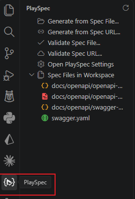
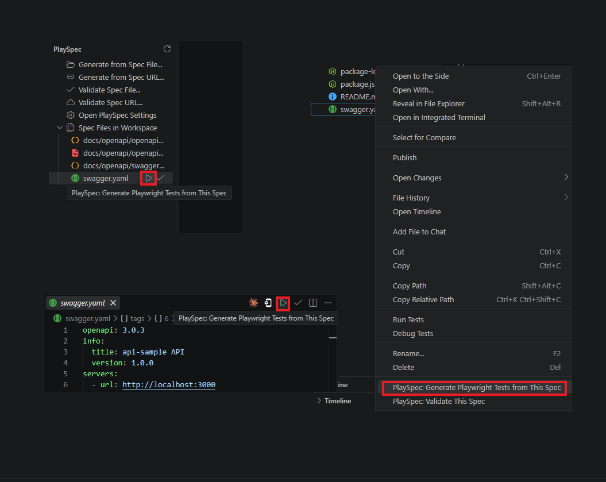
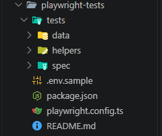
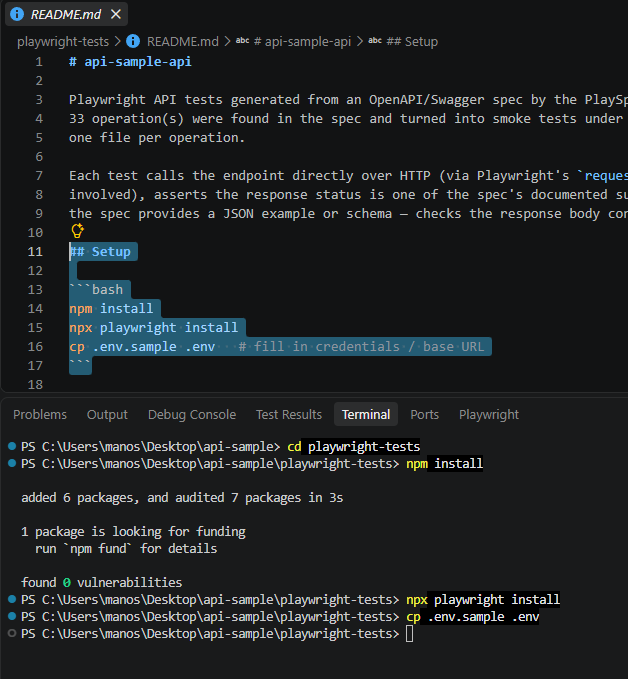
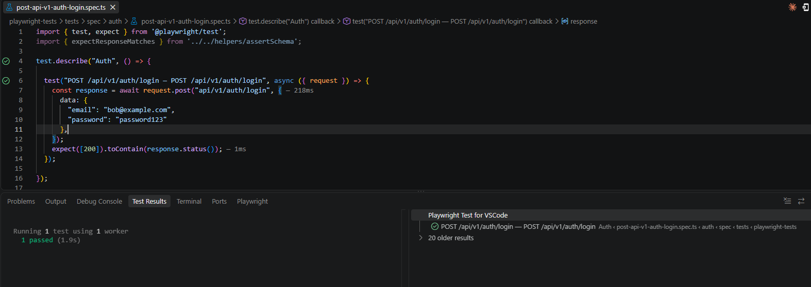
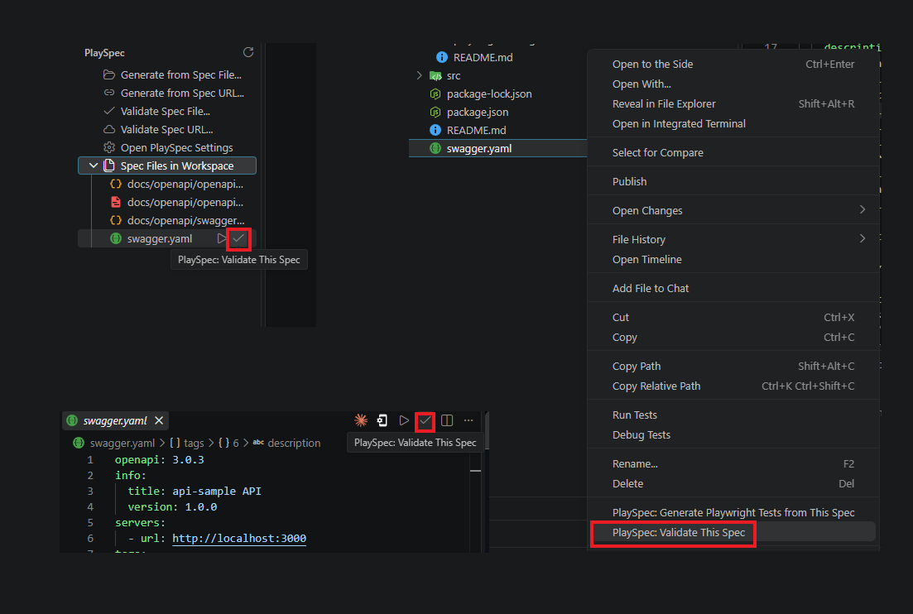
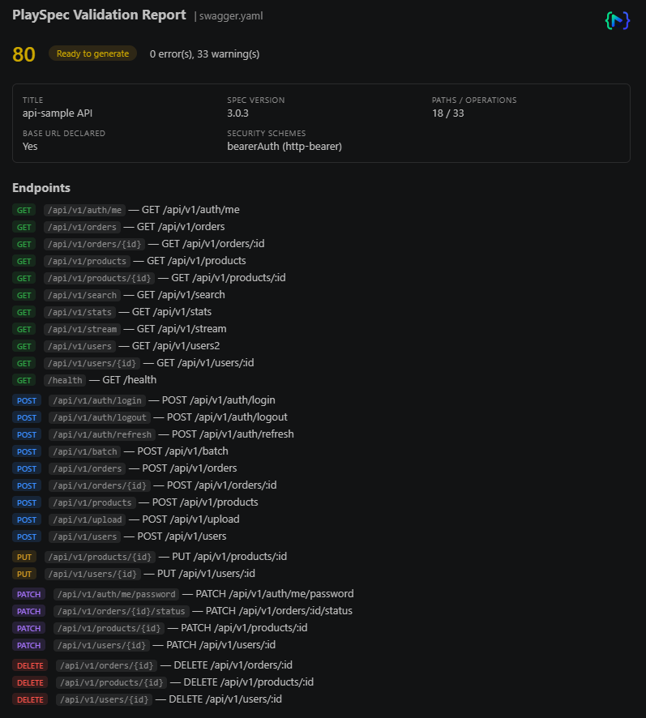

# PlaySpec — Generate Playwright Tests from OpenAPI/Swagger

Turn an OpenAPI/Swagger spec into a runnable [Playwright](https://playwright.dev/docs/api-testing)
API test project, directly inside your existing VS Code workspace. Point it at a spec file or a
live URL and it groups endpoints by tag, fills in sample parameter/body values from the spec's own
examples and schemas, wires up whatever authentication the spec declares, and writes a
self-contained, runnable test project — no separate web tool, no downloading a zip.

## Features

- **Two spec sources** — a local `.json`/`.yaml`/`.yml` file, or a live URL.
- **Endpoints grouped by tag**, one Playwright test file per operation.
- **Sample data generated automatically** from each schema's `example`/`default`/`enum`, with
  sensible type-based fallbacks — including for every query parameter, required or optional.
- **Authentication wired up** for Bearer, Basic, and API key security schemes, read from `.env` at
  test-runtime — no secrets ever baked into a test file.
- **Safe to regenerate.** Change one endpoint in the spec and only that endpoint's test file is
  touched — everything else, including your own hand-edits, is left alone. See
  [Regenerating safely](#regenerating-safely).
- **Validate a spec before generating** — catches typos and mistakes (a misspelled `in`, a
  security scheme referenced but never declared, an undeclared path parameter, missing response
  examples/schemas) in a readable report, without writing any files. See
  [Validating a spec](#validating-a-spec).
- **Three ways to trigger generation or validation**: Command Palette, right-click a spec file, or
  the dedicated PlaySpec panel in the Activity Bar.

## Quick start

1. Open the folder you want the tests written into, then open the **PlaySpec** panel from the
   Activity Bar (left-hand icon strip):

   

2. Trigger generation one of three ways:
   - **Command Palette** (`Ctrl+Shift+P` / `Cmd+Shift+P`) → **PlaySpec: Generate Playwright Tests
     from Spec File...** or **...from Spec URL...**
   - **Right-click** a `.json`/`.yaml`/`.yml` spec file in the Explorer → **PlaySpec: Generate
     Playwright Tests from This Spec** (the same action also appears as a ▶ button in the editor
     title bar when that file is open).
   - **PlaySpec panel** — lists every spec-looking file already in your workspace; click one to
     open it, or use its inline ▶ button to generate straight from it (a ✔ button next to it
     validates instead — see [Validating a spec](#validating-a-spec)). The panel also has quick
     links for "Generate from URL...", "Validate Spec File/URL...", and jumping to PlaySpec's
     settings.

   

3. PlaySpec writes a `playwright-tests/` folder (configurable) at your workspace root:

   

4. Set it up and run it:
   ```bash
   cd playwright-tests
   npm install
   npx playwright install
   cp .env.sample .env   # fill in credentials / base URL
   npm test
   ```

   

   Individual tests also show up in VS Code's Test Explorer / the Playwright Test extension:

   

## What gets generated

```
playwright-tests/
├── package.json
├── playwright.config.ts
├── .env.sample                      # copy to .env and fill in credentials / base URL
├── README.md
└── tests/
    ├── helpers/
    │   ├── assertSchema.ts          # response-shape assertion helpers
    │   ├── url.ts                   # only if the spec has path/query params
    │   └── auth/<scheme>.ts         # one file per detected security scheme
    ├── data/
    │   └── params.ts                # editable path/query parameter values
    └── spec/
        ├── .playspec-manifest.json  # bookkeeping — commit this, see below
        └── <tag>/
            └── <method>-<path>.spec.ts   # one file per operation
```

## Validating a spec

Check a spec for mistakes before generating anything — nothing is written to disk. Trigger it the
same three ways as generation:

- **Command Palette** → **PlaySpec: Validate Spec File...** or **...Spec URL...**
- **Right-click** a `.json`/`.yaml`/`.yml` spec file in the Explorer → **PlaySpec: Validate This
  Spec** (also available as a ✔ button in the editor title bar when that file is open).
- **PlaySpec panel** → **Validate Spec File...** / **Validate Spec URL...**, or the inline ✔ button
  next to any file in the auto-discovered spec list.



The result opens as a report with an overall score and a pass/warning/error breakdown by category:



| Category | Catches |
|---|---|
| Schema structure | Malformed OpenAPI/Swagger (e.g. a misspelled field like `in` or `schema`) — reported against the actual path/method/parameter it belongs to, not a raw JSON pointer. |
| Security definitions | A `security` requirement naming a scheme (e.g. a typo'd `bearerAuthf`) that was never declared under `components.securitySchemes`. |
| Undeclared path parameters | A `{name}` in the path template with no matching `in: path` parameter — this one *does* block generation, since the resulting test can never pass. |
| Missing response examples | Operations with no response `example`/`schema` to assert against — the generated test would only check the HTTP status code. |
| Generation readiness | No base URL (`servers`/`host`) declared, operations missing a `summary`, or a tag not listed in the spec's top-level `tags` catalog. |

Only "Undeclared path parameters" and outright schema-structure errors block generation; everything
else is a warning you can safely generate through if you choose to.

## Editing test data

Path parameters and every query parameter an operation declares — required or optional — live in
`tests/data/params.ts`, keyed by `"METHOD /path"`. Path params and required query params come
pre-filled with a placeholder derived from the spec; optional query params are left **blank**
unless the spec gave an explicit example — a blank value means that parameter is simply left out of
the request. Fill one in to have it sent.

Request bodies are generated inline per test from the spec's schema — edit the test file directly
if a specific test needs different data.

## Regenerating safely

Re-run generation against an updated spec whenever you want — it's designed to be safe to do
repeatedly:

- An operation's test file is only rewritten if that operation actually changed in the spec
  (tracked via a content hash in `tests/spec/.playspec-manifest.json`) — an unrelated, hand-edited
  test is never touched. **Commit this manifest file to version control** so this stays true for
  everyone working on the project.
- `tests/data/params.ts` is merged, not replaced — values you've filled in are kept.
- `package.json` only ever gets scripts/dependencies *added*, never removed.
- `playwright.config.ts`, `.env.sample`, and the helper files are created once and never touched
  again.
- If an operation is removed from the spec, its test file is left in place (not deleted) — you'll
  get a notification listing which file(s) no longer match anything, so you can decide.

## Authentication

| Spec security scheme | Generated as |
|---|---|
| `http` / `bearer` | `Authorization: Bearer <token>`, read from `.env` |
| `http` / `basic` | `Authorization: Basic <base64>`, read from `.env` |
| `apiKey` | Sent under the scheme's declared header name, read from `.env` |
| OAuth2 / OpenID Connect / cookie-based | Detected but not generated — add manually if needed |

Each test only sends the credentials for the scheme(s) its own operation actually requires — filling
in credentials for one scheme never affects tests using another.

## Settings

| Setting | Default | Description |
|---|---|---|
| `playspec.outputFolderName` | `"playwright-tests"` | Folder created at the workspace root. |
| `playspec.skipResponseValidation` | `false` | Default written into the generated `.env.sample`'s `SKIP_RESPONSE_VALIDATION`. |

## Known limitations

- Only `application/json` request/response bodies are handled.
- Only the first alternative in an operation's `security` requirements is used (schemes *within*
  that one alternative are all merged in).
- OAuth2, OpenID Connect, and cookie-based auth are detected but not generated.
- Example values are generated deterministically from the spec, not randomized.

## Feedback

Found a bug or have a feature request? Open an issue on
[GitHub](https://github.com/MKarapiperakis/play-spec-extension/issues).
